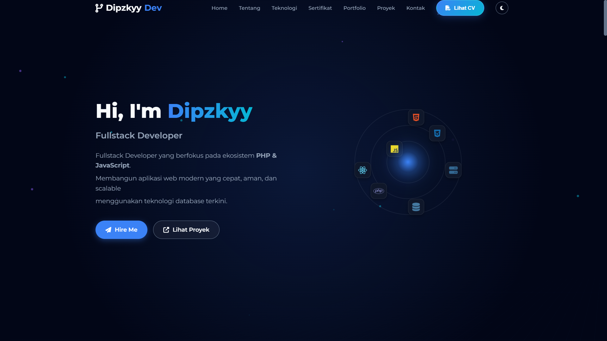

# 🚀 Dipzkyy Portfolio Website

> **Modern, Responsive, and Interactive Personal Portfolio**
> 
> *Showcasing Fullstack Development skills with a touch of 3D animations.*


## 📋 Tentang Project

Website ini adalah portofolio pribadi **Diva Islamy Rizky Akbar (Dipzkyy)**, dirancang untuk menampilkan profil, keahlian, dan proyek-proyek terbaru secara interaktif. 

Dibangun menggunakan **Vanilla JavaScript**, website ini mengutamakan performa tanpa ketergantungan framework yang berat, namun tetap memiliki fitur canggih seperti **PDF Viewer terintegrasi** dan **Integrasi API GitHub**.

## ✨ Fitur Utama

* **🎨 Dynamic Theming:** Mode Gelap (Dark) & Terang (Light) yang tersimpan otomatis.
* **🌐 3D Skill Matrix:** Visualisasi skill interaktif menggunakan animasi CSS 3D (Orbit Animation).
* **📄 Built-in PDF Viewer:** Membaca CV dan Sertifikat langsung di website tanpa download (menggunakan `PDF.js`).
* **🔗 GitHub Integration:** Mengambil data repository, stars, dan followers secara *real-time* dari GitHub API.
* **📱 Fully Responsive:** Tampilan optimal dari Desktop hingga Mobile.
* **⚡ Performance:** Lazy loading gambar dan animasi scroll yang halus.
* **✉️ Contact Form:** Formulir kontak fungsional (terintegrasi dengan Formspree).

## 🛠️ Teknologi yang Digunakan

| Tech | Deskripsi |
| :--- | :--- |
|  | Struktur Semantik |
|  | Styling, Animations, Variables |
|  | Logic, DOM Manipulation, API Fetching |
|  | Rendering Dokumen PDF |

## 🚀 Cara Menjalankan (Local)

Karena project ini adalah *static site*, menjalankannya sangat mudah:

1.  **Clone repository ini:**
    ```bash
    git clone [https://github.com/dipzProjekCoba/portofolio](https://github.com/dipzProjekCoba/portofolio.git)
    ```

2.  **Buka folder project:**
    ```bash
    cd nama-repo-kamu
    ```

3.  **Jalankan:**
    * Cukup buka file `index.html` di browser kamu.
    * *Rekomendasi:* Gunakan ekstensi **Live Server** di VS Code agar fitur PDF Viewer berjalan lancar (karena CORS policy pada browser).

## 📂 Struktur Folder

```text
/
├── assets/
│   ├── pdf/          # File CV dan Sertifikat
│   └── img/          # Foto profil dan aset gambar
├── style.css         # Styling utama & Variabel CSS
├── script.js         # Logika utama, PDF Viewer, & GitHub API
└── index.html        # Struktur halaman utama